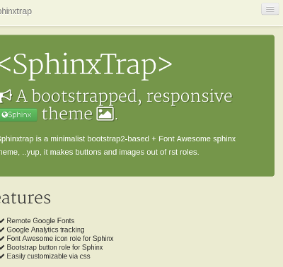

Usage
=====

Font Awesome icons
------------------

You can add Font Awesome icons by using the icon role:

.. code-block:: rst

    :icon:`rocket,2x,pull-right`

this will produce (after javascript gets processed by the browser):

.. code-block:: html

    <i class="icon-rocket icon-2x icon-pull-right"></i>

Which renders as: :icon:`rocket,2x,pull-right`

Bootstrap buttons
-----------------

You can add bootstrap buttons via the btn role, ex:

.. code-block:: rst

    :btn:`Sphinx <http://sphinx-doc.org/>,btn,btn-success,icon-globe`

Renders as :btn:`Sphinx<http://sphinx-doc.org/>,btn-success,icon-globe`

    
The format is: ``link <url>,html-class,html-class``. 

.. note::

    The ``:btn:`` role needs the "icon-" part of the css class to use FA icons.

Bootstrap containers
--------------------

Boostrap containers such as the hero-units and wells, as well as helper classes
like pull-left, pull-right, muted, clearfix, emphasis classes, etc, can be added 
as arguments to the container directive, as ther're just css classes.

.. code-block:: rst

    .. container:: hero-unit hero-first-h2  
        
        My super-duper hero unit heading!
    
        Lorem ipsum dolor sit amet, consectetur adipiscing elit. Ut lacinia, massa
        at luctus facilisis, nibh quam faucibus diam, in gravida nibh sapien vel
        nisl.

Renders as:

.. container:: hero-unit hero-first-h2 
    
    My super-duper hero unit heading!

    Lorem ipsum dolor sit amet, consectetur adipiscing elit. Ut lacinia, massa
    at luctus facilisis, nibh quam faucibus diam, in gravida nibh sapien vel
    nisl.

There are some js hacks to produce a heading inside a container directive
(which docutils won't allow) by adding some extra classes:

hero-relocate-h1:
    Adding this class as well as the hero-unit to a container will move the
    previous h1 tag **inside** the container.

hero-first-h2:
    Adding hero-first-h2 will convert the first paragraph to a heading (h2).

Overriding styles
-----------------

Just drop a custom css file to the static directory and add the file in the
css_files list in :ref:`theme-options`. 

Here is a sample:

.. code-block:: css

    /*A greeny theme*/

    body{ background-color: #EBEBD1; }
    pre { background-color: #CDE2B7;}
    .hero-unit { background-color: #75964A; }
    .hero-unit h2 { text-shadow: 2px 2px rgba(0, 0, 0, 0.27); }
    .highlight { background: #DAD6E9; }
    .navbar-inner {
        background-color: #F2F3DF;
        background-image : none;
        border: 1px solid #FFFFFF;
     }

And here the output,

.. cssclass:: img-rounded

